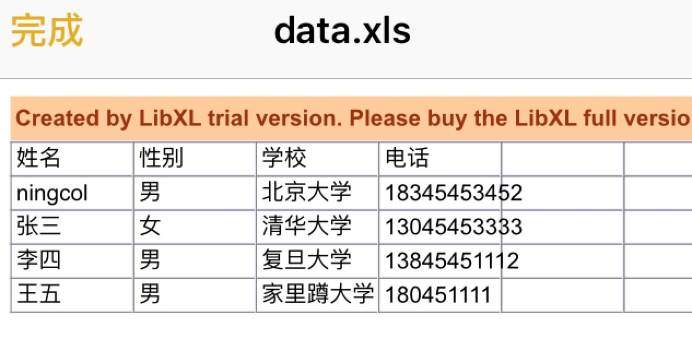

#ExportDataToExcel


==============

**导出Excel操作**


**导出Excel样式**



##Purpose

ExportDataToExcel 是一个导出数组至Excel的Demo。

- 在开发时有时候会遇到把tableView等数据导出来统计。
- **Demo中需要下载[LibXL.framework地址](http://www.libxl.com/download.html)**


##Description

```objective-c
self.nameArray = @[@"ningcol",@"张三",@"李四",@"王五"];
self.sexArray = @[@"男",@"女",@"男",@"男"];
self.schoolArray = @[@"北京大学",@"清华大学",@"复旦大学",@"家里蹲大学"];
self.phoneArray = @[@"18345453452",@"13045453333",@"13845451112",@"180451111"];
```
```objective-c
  SheetHandle sheet = xlBookAddSheet(book, "Sheet1", NULL);
  //第一个参数代表插入哪个表，第二个是第几行（默认从0开始），第三个是第几列（默认从0开始）
  xlSheetWriteStr(sheet, 1, 0, "姓名", 0);
  xlSheetWriteStr(sheet, 1, 1, "性别", 0);
  xlSheetWriteStr(sheet, 1, 2, "学校", 0);
  xlSheetWriteStr(sheet, 1, 3, "电话", 0)
```

 